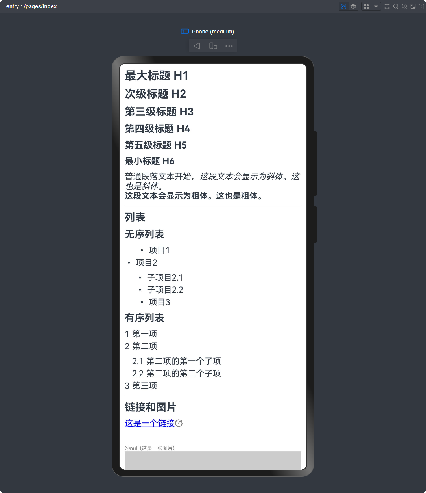
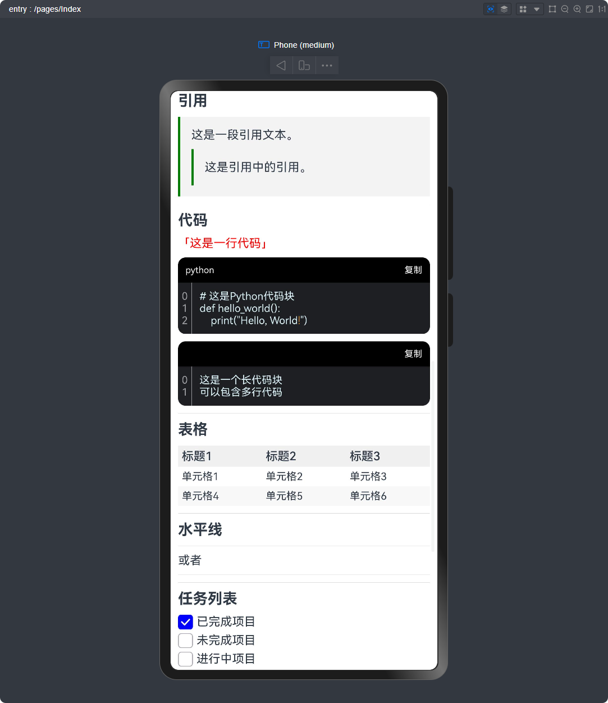
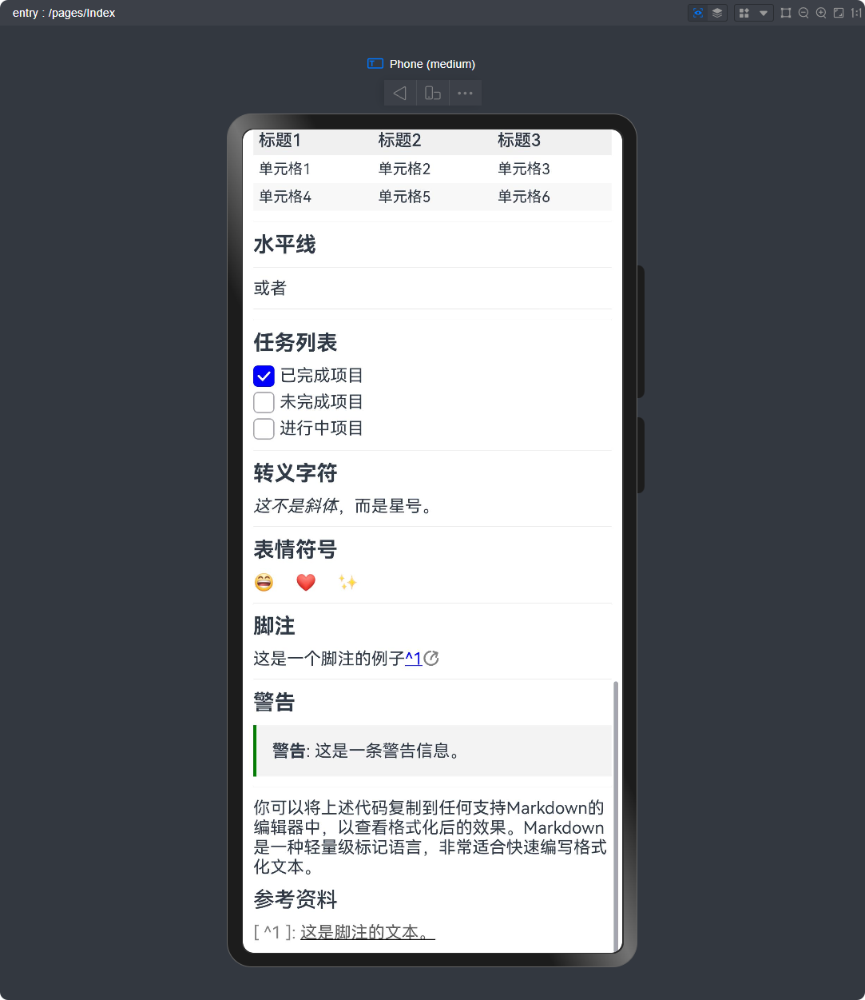
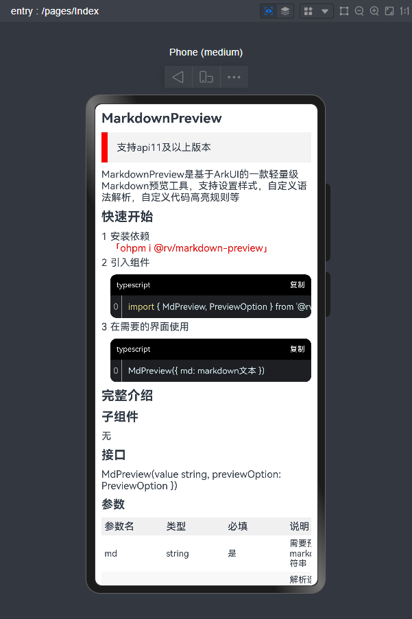
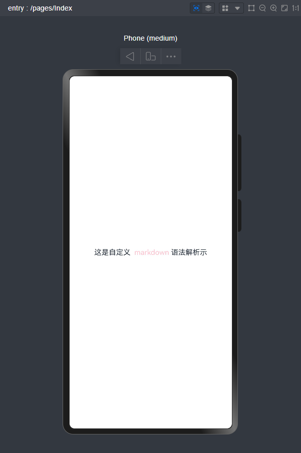
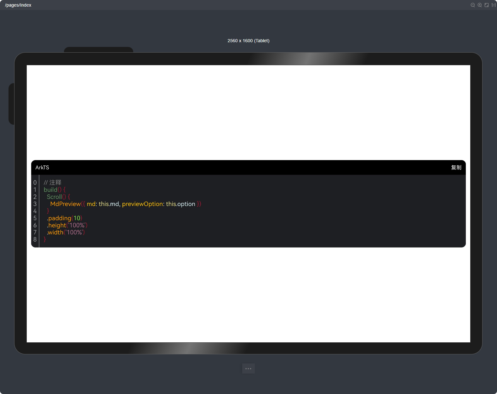

# MarkdownPreview

> 支持api11及以上版本

MarkdownPreview是基于ArkUI的一款轻量级Markdown预览工具，支持设置样式，自定义语法解析，自定义代码高亮规则等。

解析Markdown：修改自[marked](https://github.com/markedjs/marked)

[查看预览效果](#演示)

## 快速开始

1. 安装依赖
   `ohpm i @rv/markdown-preview`
2. 引入组件

   ```typescript
   import { MdPreview, PreviewOption } from '@rv/markdown-preview';
   ```
3. 在需要的界面使用

   ```typescript
   MdPreview({ md: markdown文本 })
   ```

## 完整介绍

### 子组件

无

### 接口

MdPreview(value:{ md: string, previewOption: PreviewOption })

#### 参数

| 参数名           | 类型                                   | 必填 | 说明                        |
|---------------|--------------------------------------|----|---------------------------|
| md            | string                               | 是  | 需要预览的 markdown 字符串        |
| previewOption | [PreviewOption](#PreviewOption-对象说明) | 否  | 解析选项。支持语法解析、代码高亮、自定义样式等选项 |

### PreviewOption-对象说明

| 名称             | 类型                                                 | 说明               |
|----------------|----------------------------------------------------|------------------|
| blockquoteAttr | [BlockquoteAttr](#BlockquoteAttr-对象说明)             | 引用块属性            |
| fontAttr       | [FontAttr](#FontAttr-对象说明)>                        | 字体属性             |
| heading        | Record<number`(标题等级)`, [FontAttr](#FontAttr-对象说明)> | 标题属性             |
| listAttr       | [ListAttr](#ListAttr-对象说明)                         | 列表属性             |
| dividerAttr    | [DividerAttr](#DividerAttr-对象说明)                   | 分割线属性            |
| codeAttr       | [CodeAttr](#CodeAttr-对象说明)                         | 代码块属性            |
| linkAttr       | [LinkAttr](#LinkAttr-对象说明)                         | 链接属性             |
| imageAttr      | [ImageAttr](#ImageAttr-对象说明)                       | 图片属性             |
| tableAttr      | [TableAttr](#TableAttr-对象说明)                       | 表格属性             |
| emphasizeAttr  | [EmphasizeAttr](#EmphasizeAttr-对象说明)               | 强调属性             |
| codeSpanAttr   | [CodeSpanAttr](#CodeSpanAttr-对象说明)                 | 代码块属性            |
| customParser   | [MdPreviewParser](#MdPreviewParser-对象说明)[]         | Markdown 自定义语法解析 |

### BlockquoteAttr-对象说明

| 名称              | 类型                                                                                                              | 默认值         | 说明       |
|-----------------|-----------------------------------------------------------------------------------------------------------------|-------------|----------|
| borderColor     | [ResourceColor](https://developer.huawei.com/consumer/cn/doc/harmonyos-references-V5/ts-types-V5#resourcecolor) | Color.Green | 引用块左边框颜色 |
| backgroundColor | [ResourceColor](https://developer.huawei.com/consumer/cn/doc/harmonyos-references-V5/ts-types-V5#resourcecolor) | "#f3f3f3"   | 引用块背景色   |
| padding         | [Length](https://developer.huawei.com/consumer/cn/doc/harmonyos-references-V5/ts-types-V5#length)               | 15          | 引用块内边距   |
| borderWidth     | [Length](https://developer.huawei.com/consumer/cn/doc/harmonyos-references-V5/ts-types-V5#length)               | 15          | 引用块左边框宽度 |

### FontAttr-对象说明

| 名称     | 类型                                                                                                                                     | 默认值               | 说明   |
|--------|----------------------------------------------------------------------------------------------------------------------------------------|-------------------|------|
| size   | [Length](https://developer.huawei.com/consumer/cn/doc/harmonyos-references-V5/ts-types-V5#length)                                      | 16                | 字体大小 |
| weight | number \| string \| [FontWeight](https://developer.huawei.com/consumer/cn/doc/harmonyos-references-V5/ts-appendix-enums-V5#fontweight) | FontWeight.Normal | 字体粗细 |
| family | string \| [Resource](https://developer.huawei.com/consumer/cn/doc/harmonyos-references-V5/ts-types-V5#resource)                        | -                 | 字体粗细 |
| style  | [FontStyle](https://developer.huawei.com/consumer/cn/doc/harmonyos-references-V5/ts-appendix-enums-V5#fontstyle)                       | FontStyle.Normal  | 字体样式 |
| color  | [ResourceColor](https://developer.huawei.com/consumer/cn/doc/harmonyos-references-V5/ts-types-V5#resourcecolor)                        | 系统默认字体颜色          | 字体颜色 |

### ListAttr-对象说明

| 名称                | 类型                                                                                                              | 默认值                                       | 说明           |
|-------------------|-----------------------------------------------------------------------------------------------------------------|-------------------------------------------|--------------|
| numberSpace       | string \| number                                                                                                | 5                                         | 列表序号与段落之间的间距 |
| lineSpace         | string \| number                                                                                                | 5                                         | 行间距          |
| taskSelectedColor | [ResourceColor](https://developer.huawei.com/consumer/cn/doc/harmonyos-references-V5/ts-types-V5#resourcecolor) | Color.Blue                                | 列表项间距        |
| numberColor       | [ResourceColor](https://developer.huawei.com/consumer/cn/doc/harmonyos-references-V5/ts-types-V5#resourcecolor) | null                                      | 序号颜色         |
| orderStrategy     | (orderNums: number[]) => string                                                                                 | `orderNums.map(num => num + 1).join(".")` | 序号生成策略       |
| unOrderStrategy   | (orderNums: number[]) => string                                                                                 | `() => "•"`                               | 序号生成策略       |

#### 其中

```typescript
/**
 * 有序列表序号生成策略
 * @param orderNums 祖先列表序号数组，数组长度代表层级
 * @returns 生成的序号
 */
orderStrategy: (orderNums: number[]) => string
```

```typescript
/**
 * 无序列表序号生成策略
 * @param unOrderNums 祖先列表序号数组,数组长度代表层级
 * @returns 生成的序号
 */
unOrderStrategy: (unOrderNums: number[]) => string
```

### DividerAttr-对象说明

| 名称      | 类型                                                                                                                     | 默认值               | 说明       |
|---------|------------------------------------------------------------------------------------------------------------------------|-------------------|----------|
| width   | number \| string                                                                                                       | "1px"             | 分割线的宽度   |
| color   | [ResourceColor](https://developer.huawei.com/consumer/cn/doc/harmonyos-references-V5/ts-types-V5#resourcecolor)        | '#33182431'       | 分割线的颜色   |
| lineCap | [LineCapStyle](https://developer.huawei.com/consumer/cn/doc/harmonyos-references-V5/ts-appendix-enums-V5#linecapstyle) | LineCapStyle.Butt | 分割线的端点样式 |

### CodeAttr-对象说明

| 名称                   | 类型                                                                                                              | 默认值         | 说明       |
|----------------------|-----------------------------------------------------------------------------------------------------------------|-------------|----------|
| titleBackgroundColor | [ResourceColor](https://developer.huawei.com/consumer/cn/doc/harmonyos-references-V5/ts-types-V5#resourcecolor) | Color.Black | 标题背景颜色   |
| titleTextColor       | [ResourceColor](https://developer.huawei.com/consumer/cn/doc/harmonyos-references-V5/ts-types-V5#resourcecolor) | Color.White | 标题文字颜色   |
| titleTextSize        | number                                                                                                          | 12          | 标题文字大小   |
| borderRadius         | number                                                                                                          | 10          | 圆角大小     |
| codeBackgroundColor  | [ResourceColor](https://developer.huawei.com/consumer/cn/doc/harmonyos-references-V5/ts-types-V5#resourcecolor) | "#1E1F22"   | 代码区域背景颜色 |
| codeTextSize         | number                                                                                                          | 14          | 代码文字大小   |
| lineNumberColor      | [ResourceColor](https://developer.huawei.com/consumer/cn/doc/harmonyos-references-V5/ts-types-V5#resourcecolor) | "#9A9EA3"   | 行号颜色     |

#### 其中

代码预览时，若需要自定义语言高亮显示，则在此处注册高亮规则，以实现自定义语法解析。

```typescript
/**
 * 注册语言解析规则
 * @param language 语言类型
 * @param rule 解析规则
 */
registerLanguage: (language: string, rule: LanguageRule[]) => void
```

### LinkAttr-对象说明

| 名称              | 类型                                                                                                                                                                                                | 默认值        | 说明       |
|-----------------|---------------------------------------------------------------------------------------------------------------------------------------------------------------------------------------------------|------------|----------|
| color           | [ResourceColor](https://developer.huawei.com/consumer/cn/doc/harmonyos-references-V5/ts-types-V5#resourcecolor)                                                                                   | Color.Blue | 超链接字体颜色  |
| showDecoration  | boolean                                                                                                                                                                                           | true       | 是否显示下划线  |
| decorationColor | [ResourceColor](https://developer.huawei.com/consumer/cn/doc/harmonyos-references-V5/ts-types-V5#resourcecolor)                                                                                   | Color.Blue | 超链接下划线颜色 |
| showSymbol      | boolean                                                                                                                                                                                           | true       | 是否显示符号   |
| symbolColor     | [ResourceColor](https://developer.huawei.com/consumer/cn/doc/harmonyos-references-V5/ts-types-V5#resourcecolor)                                                                                   | Color.Gray | 后置符号颜色   |
| onClick         | (event: [ClickEvent](https://developer.huawei.com/consumer/cn/doc/harmonyos-references-V5/ts-universal-events-click-V5#clickevent%E5%AF%B9%E8%B1%A1%E8%AF%B4%E6%98%8E), link`链接`: string) => void | () => {}   | 超链接点击事件  |

### ImageAttr-对象说明

| 名称             | 类型                                                                                                                                                                                                      | 默认值        | 说明     |
|----------------|---------------------------------------------------------------------------------------------------------------------------------------------------------------------------------------------------------|------------|--------|
| border         | [BorderOptions](https://developer.huawei.com/consumer/cn/doc/harmonyos-references-V5/components-ts-borderoptions-V5)                                                                                    | {}         | 边框     |
| titleColor     | [ResourceColor](https://developer.huawei.com/consumer/cn/doc/harmonyos-references-V5/ts-types-V5#resourcecolor)                                                                                         | Color.Gray | 标题颜色   |
| titleIconColor | [ResourceColor](https://developer.huawei.com/consumer/cn/doc/harmonyos-references-V5/ts-types-V5#resourcecolor)                                                                                         | Color.Gray | 标题图标颜色 |
| titleSize      | number                                                                                                                                                                                                  | 10         | 标题大小   |
| onClick        | (clickEvent: [ClickEvent](https://developer.huawei.com/consumer/cn/doc/harmonyos-references-V5/ts-universal-events-click-V5#clickevent%E5%AF%B9%E8%B1%A1%E8%AF%B4%E6%98%8E), url`图片链接`: string) => void | () => {}   | 图片点击事件 |

### TableAttr-对象说明

| 名称               | 类型                                                                                                                   | 默认值                           | 说明                         |
|------------------|----------------------------------------------------------------------------------------------------------------------|-------------------------------|----------------------------|
| headerFont       | [FontAttr](#FontAttr-对象说明)                                                                                           | { weight: FontWeight.Medium } | 表头字体属性                     |
| headerBackground | [ResourceColor](https://developer.huawei.com/consumer/cn/doc/harmonyos-references-V5/ts-types-V5#resourcecolor)      | "#F0F0F0"                     | 表头背景                       |
| oddBackground    | [ResourceColor](https://developer.huawei.com/consumer/cn/doc/harmonyos-references-V5/ts-types-V5#resourcecolor)      | Color.White                   | 表格单数行背景                    |
| evenBackground   | [ResourceColor](https://developer.huawei.com/consumer/cn/doc/harmonyos-references-V5/ts-types-V5#resourcecolor)      | "#F8F8F8"                     | 双数行背景                      |
| border           | [BorderOptions](https://developer.huawei.com/consumer/cn/doc/harmonyos-references-V5/components-ts-borderoptions-V5) | {}                            | 表格边框                       |
| cellBorder       | [BorderOptions](https://developer.huawei.com/consumer/cn/doc/harmonyos-references-V5/components-ts-borderoptions-V5) | {}                            | 单元格边框                      |
| columnWidth      | number                                                                                                               | 100                           | 列宽，单位 vp，当总列宽小于屏幕宽时，默认撑满屏幕 |

### EmphasizeAttr-对象说明

| 名称           | 类型                                                                                                               | 默认值         | 说明         |
|--------------|------------------------------------------------------------------------------------------------------------------|-------------|------------|
| delLineColor | [ResourceColor](https://developer.huawei.com/consumer/cn/doc/harmonyos-references-V5/ts-types-V5#resourcecolor)? | Color.Black | 删除线颜色，可选属性 |

### CodeSpanAttr-对象说明

| 名称                  | 类型                                                                                                                                                                                                    | 默认值                           | 说明     |
|---------------------|-------------------------------------------------------------------------------------------------------------------------------------------------------------------------------------------------------|-------------------------------|--------|
| fontStyle           | [FontAttr](#FontAttr-对象说明)                                                                                                                                                                            | { color: Color.Red }          | 字体样式   |
| textBackgroundStyle | [TextBackgroundStyle](https://developer.huawei.com/consumer/cn/doc/harmonyos-references-V5/ts-basic-components-containerspan-V5#textbackgroundstyle%E5%AF%B9%E8%B1%A1%E8%AF%B4%E6%98%8E)              | {}                            | 背景样式   |
| previewStrategy     | (code: string) => string                                                                                                                                                                              | (code: string) => `「${code}」` | 代码预览策略 |
| onClick             | (event: [ClickEvent](https://developer.huawei.com/consumer/cn/doc/harmonyos-references-V5/ts-universal-events-click-V5#clickevent%E5%AF%B9%E8%B1%A1%E8%AF%B4%E6%98%8E), text`被点击的文本`: string) => void | () => {}                      | 点击事件   |

### MdPreviewParser-对象说明

建议查看[marked文档](https://marked.js.org/)使用
两个参数：

1. extension： 解析器扩展，实现自定义解析器

   | 名称          | 类型                                                            | 必须 | 说明                           |
      |-------------|---------------------------------------------------------------|----|------------------------------|
   | name        | string                                                        | 是  | 解析的代码块名字                     |
   | level       | 'block' \| 'inline'                                           | 是  | 解析的层级：block：块级，inline：行级     |
   | start       | (line: string) => index                                       | 否  | 解析可能开始的位置，防止被别的解析覆盖，行级模式建议配置 |
   | tokenizer   | (src: string,tokens: Token[] \| TokensList) => Tokens.Generic | 是  | 解析器，返回解析后的结果                 |
   | childTokens | string[] \| undefined                                         | 否  | 嵌套解析的token，默认为空数组            | 
2. builder： 需要`@Builder`修饰的函数，当前解析出来的文本该如何显示。

   ！！！注意：builder函数中，当`level`的值为`inline`时，必须返回一个`Text`的可用子组件，否则会报错。

## 演示





## 功能演示

### 设置基础样式

```typescript
// 定义预览选项
option: PreviewOption = new PreviewOption()

// 将引用块边框改为红色，宽度为10
aboutToAppear():
void {
  this
  .
  option
  .
  blockquoteAttr
  .
  borderColor = Color.Red
  this
  .
  option
  .
  blockquoteAttr
  .
  borderWidth = 10
}

build()
{
  Scroll()
  {
    // 调用预览器
    MdPreview({ md: this.md, previewOption: this.option })
  }
  .
  padding(10)
    .height('100%')
    .width('100%')
}
```



### 自定义语法解析

此代码为自定义解析行内中被 `@` 包裹的文章，显示为粉色

```typescript
import { MdPreview, PreviewOption, Tokens } from '@rv/markdown-preview';

@
Entry
@
Component
struct
Index
{
  @
  State
  md: string = `这是自定义  @markdown@ 语法解析示`
  option: PreviewOption = new PreviewOption()
  aboutToAppear():
  void {
    this
    .
    option
    .
    customParser
    .
    push({
    // 设置解析方式
      extension: {
        name: 'test',
        level: 'inline',
        start: (line: string) => line.indexOf("@"),
        tokenizer: (src: string) => {
          const match = /^@(.*)@/.exec(src)
          if (match) {
            return {
              type: "test",
              raw: match[0],
              text: match[1]
            }
          } else {
            return undefined
          }
        }
      },
    // 设置解析后显示的组件
      builder: this.test
    })
  }

  @
  Builder
  test(token:
  Tokens.Generic
  )
  {
    // 行内解析的内容一定要为Text组件的可用子组件
    Span(token.text).fontColor(Color.Pink)
  }
  build()
  {
    Scroll()
    {
      MdPreview({ md: this.md, previewOption: this.option })
    }
    .
    padding(10)
      .height('100%')
      .width('100%')
  }
}
```



### 自定义代码高亮

```typescript
import { MdPreview, PreviewOption } from '@rv/markdown-preview';

@
Entry
@
Component
struct
Index
{
  @
  State
  md: string = `\`\`\`ArkTS
// 注释
build() {
  Scroll() {
    MdPreview({ md: this.md, previewOption: this.option })
  }
  .padding(10)
  .height('100%')
  .width('100%')
}
\`\`\`
`
  option: PreviewOption = new PreviewOption()

  aboutToAppear():
  void {
    this
    .
    option
    .
    codeAttr
    .
    registerLanguage
    (
    "ArkTS",
    [

    {
    parsing: (src: string) => {
      const regex =
        /^\b(?:this)\b/
      const match = regex.exec(src)
      if (match) {
        return { value: match[0], color: "#E1D984" }
      } else {
        return undefined
      }
    }
  }, // keyword
  {
    parsing: (src: string) => {
      const regex = /^ *\/\/.*|^\/\*\*?[\s\S]*?\*\//
      const match = regex.exec(src)
      if (match) {
        return { value: match[0], color: "#808080" }
      } else {
        return undefined
      }
    }
  }, // comment
  {
    parsing: (src: string) => {
      const regex = /^\b([\S]+) *\([\s\S]*\) *\{[\s\S]*/
      const match = regex.exec(src)
      if (match) {
        return { value: match[1], color: "#619061" }
      } else {
        return undefined
      }
    }
  }, // method
  {
    parsing: (src: string) => {
      const regex = /^(["']).*?\1/
      const match = regex.exec(src)
      if (match) {
        return { value: match[0], color: "#A96989" }
      } else {
        return undefined
      }
    }
  }, // string
  {
    parsing(src: string) {
      const regex = /^\b(.*)\b\(.*\)/
      const match = regex.exec(src)
      if (match) {
        return { value: match[1], color: "#ffff9a00" }
      } else {
        return undefined
      }
    }
  }, // attribute
  {
    parsing: (src: string) => {
      const regex = /^\b0x[\da-f]+\b|^\b0b[01]+\b|^\b0o[0-7]+\b|^(?:\b\d+(?:\.\d*)?[dfl]?|^\B\.\d+)(?:e[+-]?\d+)?/i
      const match = regex.exec(src)
      if (match) {
        return { value: match[0], color: "#7FDD44" }
      } else {
        return undefined
      }
    }
  }, // number
  {
    parsing: (src: string) => {
      const regex = /^[\{\}\[\]\(\)]/
      const match = regex.exec(src)
      if (match) {
        return { value: match[0], color: "#9d1731" }
      } else {
        return undefined
      }
    }
  }, // block
  {
    parsing(src: string) {
      const regex = /^(\b[a-zA-Z0-9_]+\b) *:/
      const match = regex.exec(src)
      if (match) {
        return { value: match[1], color: "#ffffc000" }
      } else {
        return undefined
      }
    }
  } // variable

  ]
  )
}

build()
{
  Scroll()
  {
    MdPreview({ md: this.md, previewOption: this.option })
  }
  .
  padding(10)
    .height('100%')
    .width('100%')
}
}
```



## 功能实现

即将实现功能：

- 欢迎提出建议

已实现功能：

- **自定义语法解析**
- **自定义代码高亮**
- 增加自定义预览样式选项

已实现预览：

- [标题](https://markdown.com.cn/basic-syntax/headings.html)
- [段落](https://markdown.com.cn/basic-syntax/paragraphs.html)
- [换行](https://markdown.com.cn/basic-syntax/line-breaks.html)
- [强调](https://markdown.com.cn/basic-syntax/emphasis.html)
- [引用](https://markdown.com.cn/basic-syntax/blockquotes.html)
- [列表](https://markdown.com.cn/basic-syntax/lists.html)
- [代码](https://markdown.com.cn/basic-syntax/code.html)
- [分割线](https://markdown.com.cn/basic-syntax/horizontal-rules.html)
- [链接](https://markdown.com.cn/basic-syntax/links.html)
- [图片](https://markdown.com.cn/basic-syntax/images.html)
- [表格](https://markdown.com.cn/extended-syntax/tables.html)
- [围栏代码块](https://markdown.com.cn/extended-syntax/fenced-code-blocks.html)
- [转义字符](https://markdown.com.cn/basic-syntax/escaping-characters.html)
- [删除线](https://markdown.com.cn/extended-syntax/footnotes.html)
- [任务列表](https://markdown.com.cn/extended-syntax/task-lists.html)
- [自动网址链接](https://markdown.com.cn/extended-syntax/automatic-url-linking.html)
- [使用 Emoji 表情](https://markdown.com.cn/extended-syntax/emoji.html)

暂未实现预览：

- [内嵌 HTML 标签](https://markdown.com.cn/basic-syntax/htmls.html)
- [标题编号](https://markdown.com.cn/extended-syntax/heading-ids.html)
- 数学公式
- 其他欢迎补充

无实现预览计划：

- [脚注](https://markdown.com.cn/extended-syntax/footnotes.html)
- [定义列表](https://markdown.com.cn/extended-syntax/definition-lists.html)


